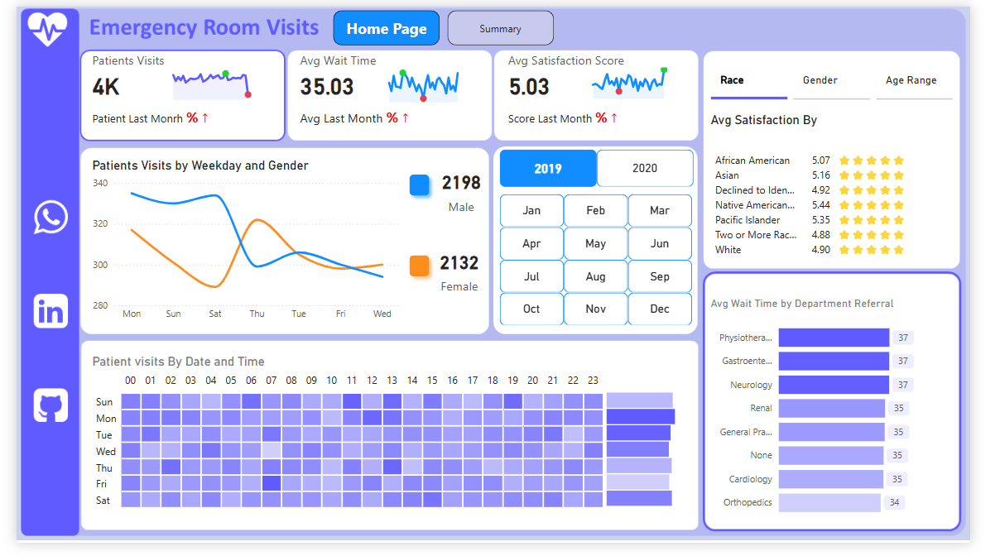

# Emergency Room Dashboard  

  

### **Project Description: Emergency Room Data Analysis Dashboard**  

### **Project Description: Emergency Room Data Analysis Dashboard**  

This project is an **interactive Power BI dashboard** designed to analyze emergency room (ER) data and provide actionable insights for healthcare professionals. The dashboard leverages **Business Intelligence (BI) tools** to help users identify key trends, patient flow patterns, and potential areas for operational improvement.

---

### **Key Features:**  
- 📊 **Data Visualization:** Interactive charts and graphs displaying ER trends, including patient admissions, wait times, and discharge rates.  
- 🔍 **Trend Analysis:** Identifies seasonal variations in patient visits, peak hours, and demand fluctuations.  
- 🛠 **Filtering & Segmentation:** Allows users to explore data by demographics, time periods, or medical conditions.  
- 🚑 **Operational Insights:** Helps in optimizing resource allocation by highlighting critical bottlenecks.  
- 📈 **Forecasting:** Potential integration of predictive models to estimate future ER demand.  

---

### **Purpose & Limitations:**  
This project is intended for **learning and training purposes only**. The dataset used is **sample data** and does not represent real medical records. While the dashboard offers valuable analytical insights, it should not be used for actual medical decision-making.  

---

## 🛠️ Technologies Used  
- **Excel** for data analysis and processing  
- **Power BI** for dashboard visualization  
- **DAX** for KPI calculations and data analysis  

## 🧮  Some Calculation 

```DAX
Calendar = 
    VAR MinYear = YEAR(MIN('Hospital ER'[Date]))
    VAR MaxYear = YEAR(MAX('Hospital ER'[Date]))

RETURN
    ADDCOLUMNS(
        FILTER(
            CALENDARAUTO(),
            YEAR([Date]) >= MinYear && YEAR([Date]) <= MaxYear
        ),
        "Year", YEAR([Date]),
        "Quarter Number", INT(FORMAT([Date],"q")),
        "Quarter", "Q" & INT(FORMAT([Date],"q")),
        "Month", FORMAT([Date],"mmm"),
        "Day", DAY([Date]),
        "DayName", FORMAT([Date], "dddd"),
        "Monthnum", MONTH([Date]),
        "Weekday", FORMAT([Date], "ddd"),
        "Weeknum", WEEKDAY([Date])
    )


```

## How to Use
1. Clone the repository:
   ```bash
   git clone https://github.com/MohamedAhmeddiye/Raw_Car_Dashboard.git
   ```
2. Open the `Emergency Room Visits My-Dashboard.pbix` file in Power BI Desktop.
3. Explore the pages and interact with the visualizations.


---
> > [!NOTE]  
✅ This project is a **practical training in data analysis** using **BI tools**.  
✅ The data used in this project is **sample data** and not real medical data.  
✅ The dashboard can be enhanced by adding additional insights, such as **geographical analysis** or **patient segmentation**.  

---  

> [!TIP]  
> Use **filters and interactions** within the dashboard for deeper insights.  
> Try **trend analysis** to understand patient flow variations over time.  
> Add **demand forecasting for emergency services** to estimate future needs.  

---  

> [!WARNING]  
> **This project is for learning and training purposes only.** The data used in this analysis is **not real** and should not be used for actual medical or operational decisions.  

---  

> [!CAUTION]  
- The data presented in this project may not reflect real medical scenarios.  
- This analysis should not be used as a basis for making operational or strategic decisions in healthcare.  
- Always refer to **verified data sources** before implementing any data-driven decisions.

## 🚀 How to Get Started?  
1. Download the **data file** and load it into **Excel / Power BI**.  
2. Open the **dashboard** and explore insights through interactive visuals.  
3. Modify formulas or filters to analyze the data as needed.  

---

## 😊Feedback

If you have any suggestions or feedback, feel free to open an issue or connect with me on [LinkedIn](linkedin.com/in/mohammed-ahmed-052769239).

---
## 📑License
This project is licensed under the MIT License. See the `LICENSE` file for details.

### 🏆 **Thank you for exploring this project!** Feel free to reach out if you have any questions. 🚀# Emergency-Room-Visits
